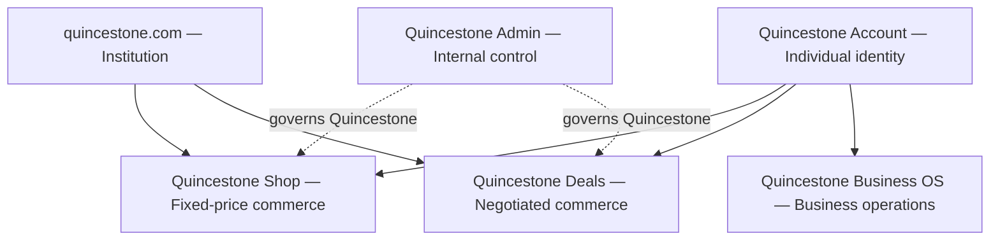
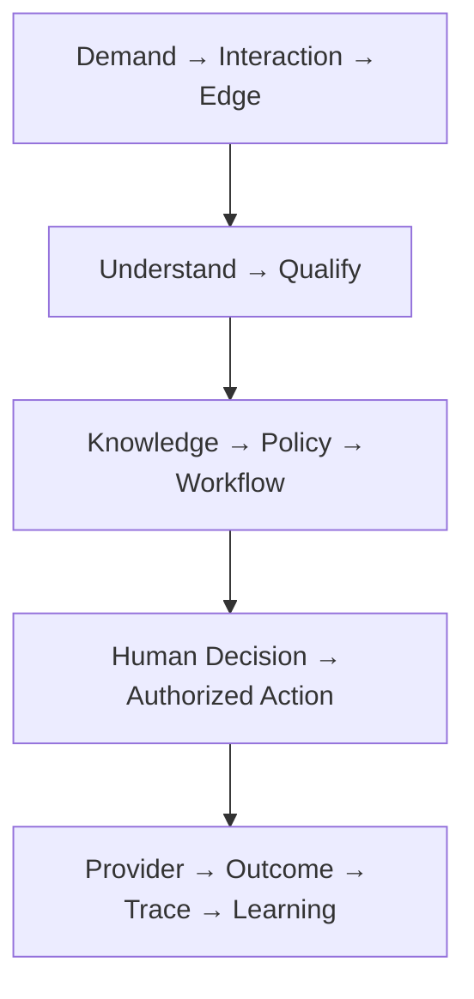
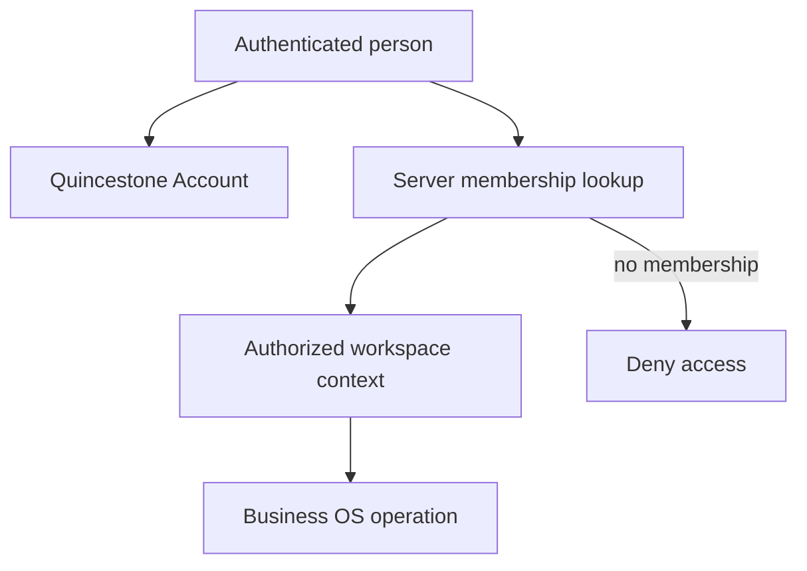
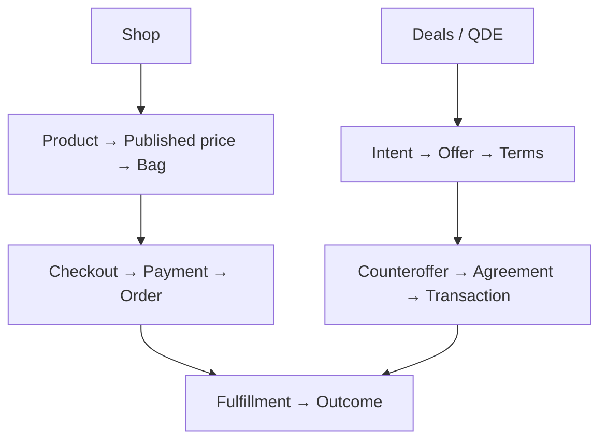
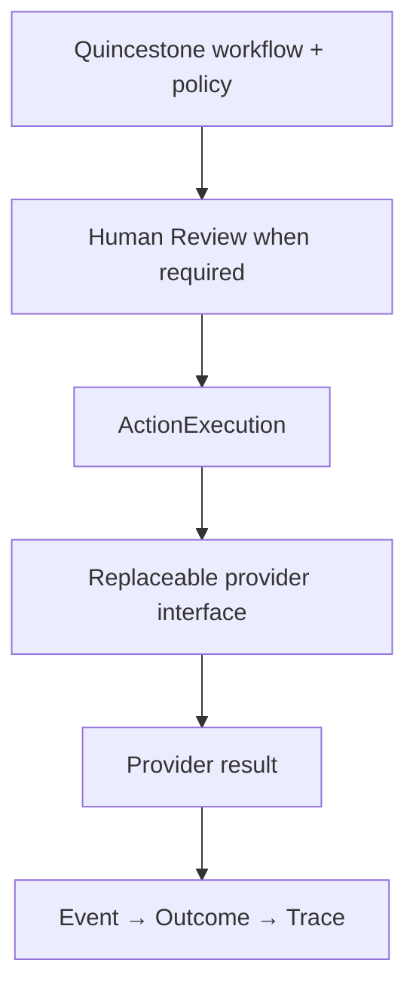
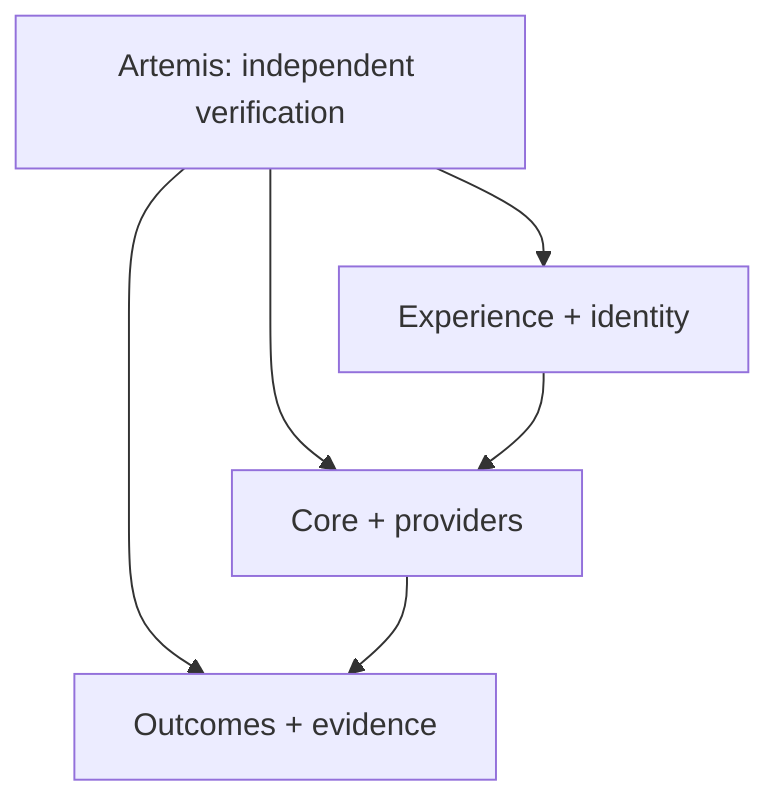

# Quincestone — Canonical Ecosystem Architecture

**Authority:** canonical architecture document

**Evidence snapshot:** 2026-09-15
**Source baseline:** `main` at `853092a490f4457d251b919fe77650535421b0ad`

Quincestone is a governed business and commerce ecosystem. Its surfaces share identity, intelligence, knowledge, policy, workflow, execution, events, outcomes and verification infrastructure without collapsing into one dashboard.

All surfaces operate on the [One Quincestone Backend](03_ONE_QUINCESTONE_BACKEND.md): one canonical Supabase project, Auth authority, migration history, entity model, and event/audit foundation. Product separation is enforced through ownership, schemas, functions, grants, RLS, and server commands—not separate databases.

> Understand demand. Operate what happens next. Scale what works.

## Status language

| State | Meaning |
|---|---|
| **IMPLEMENTED** | Source exists in the inspected revision. |
| **CONFIGURED** | Project/provider configuration was directly inspected. |
| **DEPLOYED** | A provider reports an artifact, schema or function exists. |
| **CONNECTED** | An authenticated provider connection was inspected. |
| **VERIFIED** | Exact deployed behavior or state was directly tested. |
| **PLANNED** | Approved future architecture without complete implementation. |
| **DEFERRED** | Intentionally postponed. |
| **BLOCKED** | Missing authority, access or evidence prevents completion. |
| **SUPERSEDED** | Retained history that is no longer authoritative. |

A weaker state never implies a stronger one. Frontend success is not persistence proof; a READY preview is not production verification.

## Ecosystem surfaces

| Surface | Canonical role | Must never become |
|---|---|---|
| `quincestone.com` | Institution, brand, editorial, trust, public intelligence, discovery and routing | Shop, Account, Business OS, Deals or Admin |
| `shop.quincestone.com` | Quincestone Shop: product discovery, published-price commerce, bag, checkout and orders | Negotiation system or Business OS |
| `account.quincestone.com` | Quincestone Account: individual identity, authentication and personal relationship | Business workspace or platform-admin authority |
| `app.quincestone.com` | Quincestone Business OS: authorized business workspaces | Individual Account, Shop, Deals or internal Admin |
| `QuincestoneDeal.app` | Quincestone Deals / QDE: negotiated-commerce product | Business OS module or Shop subsystem |
| `admin.quincestone.com` | Quincestone Admin: internal operator control plane | Customer workspace or ordinary membership role |

`apps/web` serves only the institutional experience. `apps/shop` is the standalone Shop application. Both inherit QVS and canonical backend contracts without sharing product ownership.

## Product and operations hierarchy

- **Quincestone Core:** identity contracts, Edge, intelligence, knowledge, policy, workflow, Human Review, ActionExecution, events, outcomes and trace.
- **Products:** Quincestone Shop, Quincestone Deals and future specialized applications.
- **Operations:** Quincestone Business OS and Quincestone Admin.
- **Independent verification:** Artemis.

Shop and Deals are peers. Shop owns fixed-price commerce; Deals owns negotiated commerce. QDE owns the deal experience; Quincestone Core owns governed execution.

## Six-layer map

| Layer | Components |
|---|---|
| **6 — Experience** | `quincestone.com`, `shop.quincestone.com`, `QuincestoneDeal.app` |
| **5 — Identity and operations** | `account.quincestone.com`, `app.quincestone.com`, `admin.quincestone.com` |
| **4 — Quincestone Core** | Edge, Intelligence, Knowledge, Policy, Workflow, Human Review, ActionExecution, Events, Outcomes, Trace |
| **3 — Capability providers** | IntelligenceProvider, BusinessProvider, CommerceProvider, CalendarProvider, PaymentProvider |
| **2 — External/open infrastructure** | Colibrì, Ever Gauzy, Google, Stripe, Supabase, Resend and other verified services |
| **Independent verification** | Artemis surrounds Layers 2–6; it is not below Layer 2 or a runtime authority |

## Quincestone Core operating loop

Edge understands intent, structures context, supports qualification, consults approved knowledge, evaluates policy, routes work and detects when human authority is required. Edge does not become authority. A score, classification or recommendation cannot approve a consequential action.

## Identity and authorization

Authentication establishes identity. Business access additionally requires server-authoritative workspace membership, role and policy checks. Platform-operator authority is separate from both personal identity and workspace membership.

## Shop and Deals

Agreement, transaction and payment states are server-authoritative. A checkout redirect is not payment proof.

## Provider boundary

Providers supply capability; they do not own Quincestone product identity, policy, authorization, workflow or UX.

- **IntelligenceProvider:** cloud AI, Colibrì, future private/local inference.
- **BusinessProvider:** Ever Gauzy, Google, future CRM/ERP/operations systems.
- **CommerceProvider:** Shopify where verified, supplier/catalog services and future commerce infrastructure.
- **PaymentProvider:** Stripe and explicitly approved alternatives.
- **CalendarProvider:** Google Calendar and verified alternatives.

Colibrì is replaceable intelligence infrastructure below Edge. It may execute models or private/local inference; it owns no Quincestone product, policy, workflow or decision.

Ever Gauzy is an optional BusinessProvider below governed execution. It may supply selected ERP, CRM, time, project, employee or operational capability; it must not become Quincestone UX or authority. No current connection or deployment is claimed.

## Artemis verification plane

Artemis may interact, observe, verify, record evidence and detect regressions across Shop–Account–Shop, checkout/order, Deals negotiation/payment, Account–App membership, Human Review–Action–Outcome, Admin authorization, provider results and device/E2E journeys. Artemis must never become runtime product authority.

## System authority

| Authority | Authoritative only for | Current evidence |
|---|---|---|
| Supabase | Shared backend platform for canonical Quincestone Auth, records, RLS, functions, events and audit evidence confirmed in [database.md](database.md) | **CONNECTED / DEPLOYED**; exact project `quincestone` verified; domain authority varies |
| Stripe | Provider payment, checkout, refund and dispute state when reconciled | Live-mode account **CONNECTED**; product/price exist; no webhook endpoint verified |
| Shopify | Downstream catalog/order capability according to verified integration | Projection schema **DEPLOYED**; runtime connection **NOT VERIFIED** |
| Resend | Email delivery when sender and actual delivery are verified | One domain **CONFIGURED**; delivery flows **NOT VERIFIED** |
| Vercel | Project configuration, artifacts and domain routing | See [deployment evidence](09_DEPLOYMENT_AND_ENVIRONMENTS.md) |
| Browser | Temporary input and local draft state | Never trusted for roles, prices, approvals, payment or persistence |
| Server | Validation, authorization, normalization, idempotency, persistence, provider calls and audit events | Must be proven per vertical slice |
| Human operator | Consequential review, exceptions, approval/rejection and controlled action | Must be independently authorized and audited |

## Engineering workflow

**INSPECT REALITY → DEFINE AUTHORITY → MODEL STATE → IMPLEMENT VERTICALLY → VERIFY EVIDENCE → DOCUMENT TRUTH → RELEASE SAFELY → LEARN FROM OUTCOMES**

Every significant feature must inspect current `main` and runtime state, name its owner/authority, define state/failure/idempotency/review behavior, implement the smallest complete vertical slice, test static/behavior/accessibility/runtime boundaries, verify the exact preview SHA, merge only with required checks clean, then verify the released production SHA. Speed comes from removing ambiguity and rework, not controls.

## Vertical-slice contract

**Experience → frontend validation → API/RPC → server authorization → server validation → idempotency → persistence → event → operational surface → human decision where required → authorized action → provider → outcome → trace → verification**

A beautiful assessment without persistence, a record without an operator surface, a redirect without Stripe confirmation, a policy label without enforcement, or frontend success without server confirmation is incomplete.

## Failure and verification

Every workflow defines validation, authentication, authorization, network, timeout, server, persistence, duplicate, provider rejection, webhook replay, partial completion, retry, recovery, audit evidence and terminal-failure states. Preserve completed input on failure; never silently duplicate records or translate an unknown result into success.

Verification proceeds through:

1. **Static:** TypeScript, lint, schema constraints and dependencies.
2. **Behavior:** unit, integration, state-machine, idempotency and authorization tests.
3. **Experience:** keyboard, screen reader, focus, touch, reduced motion, 200% zoom and breakpoints.
4. **Runtime:** API, database, RLS, Edge Functions, provider calls, logs and durable records.
5. **Release:** exact preview commit, CI, production SHA, domains and rollback readiness.
6. **Ecosystem:** Artemis device/E2E journeys, evidence and regression proof.

## Documentation authority

- This document owns ecosystem, surface, Core, provider and verification architecture.
- [One Quincestone Backend](03_ONE_QUINCESTONE_BACKEND.md) owns the shared-backend hard boundary.
- [README](../README.md) is the concise entry map; [AGENTS](../AGENTS.md) contains mandatory rules.
- [Deployment](09_DEPLOYMENT_AND_ENVIRONMENTS.md), [database](database.md) and [provider register](11_PROVIDER_REGISTER.md) own current evidence.
- Application READMEs own local responsibilities and development boundaries.
- Release records and phase freezes are historical evidence, not current architecture authority.
